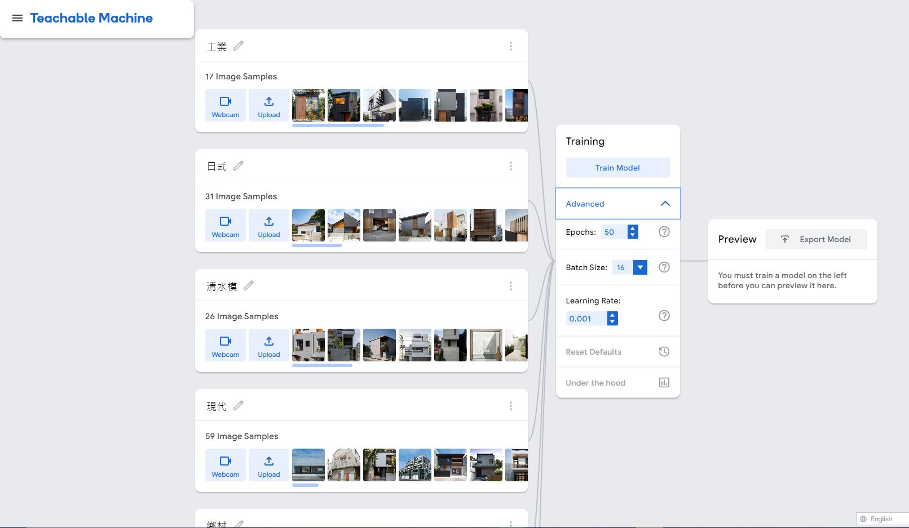
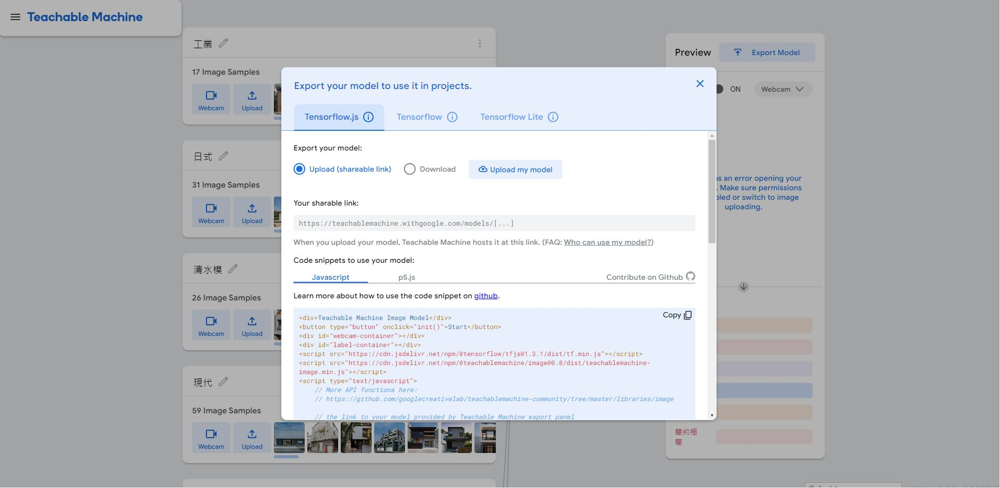

# HouseStyleClassfier-train-model

Step 1: 將訓練資料下載之後將每個資料夾的分類名稱輸入在Google Teachable Machine並上傳。  
  
Step 2: 點擊在Tranining標籤下的Anvanced，調整參數後，點擊Train Model。  
  
Step 3: 點擊Preview標籤的Export Model 輸出模型，你可以在自己的介面程式碼裡使用Teachable Machine所給連結或下載使用，本項目為下載模型使用    

